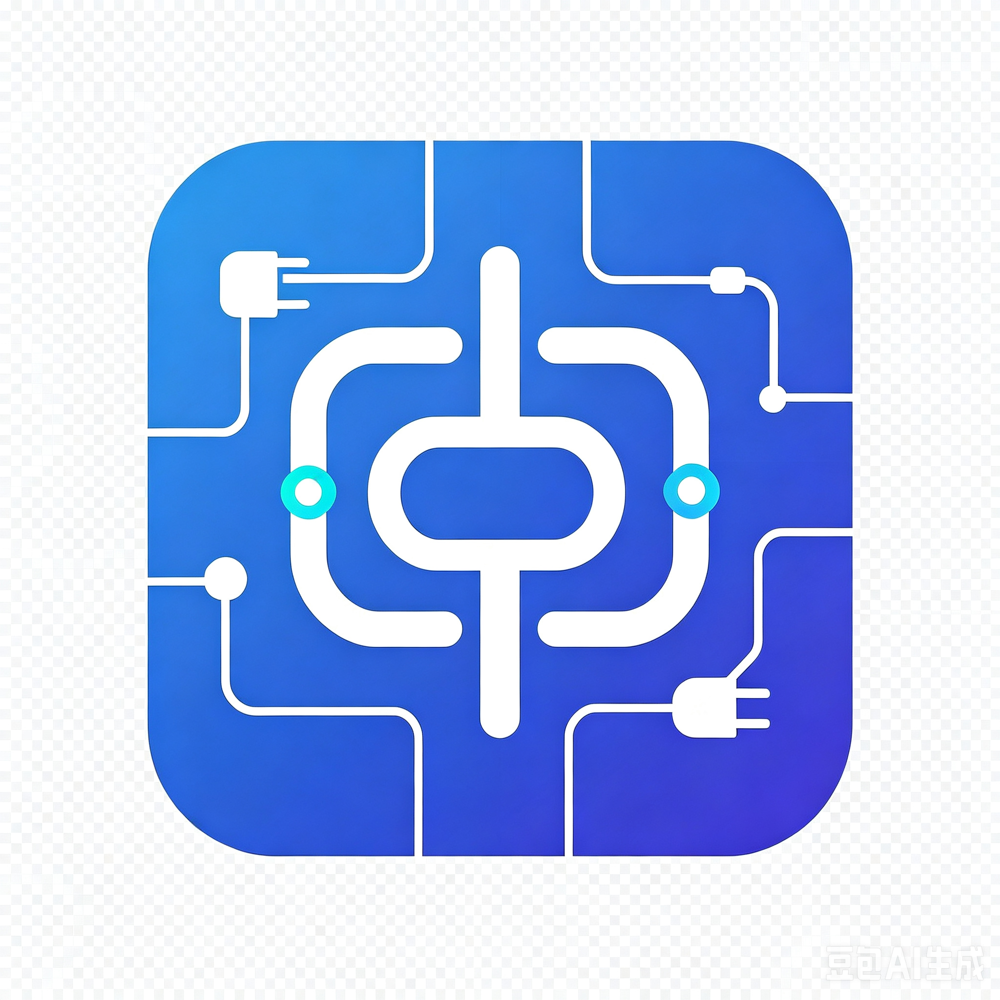

<p align="center">
  
</p>

<h1 align="center">CN Scraper MCP</h1>

<p align="center">
  <strong>Let AI agents search Chinese web platforms — Taobao, JD, Xiaohongshu, Zhihu, Weibo, Douyin, and ZSXQ — through one MCP server.</strong>
</p>

<p align="center">
  <a href="https://python.org"></a>
  <a href="https://modelcontextprotocol.io"></a>
  <a href="LICENSE"></a>
  <a href="https://github.com/goesByhc/cn-scraper-mcp/actions/workflows/ci.yml"></a>
</p>

---

## Why?

Every AI agent can search the web. But Chinese platforms don't welcome bots:

- **Taobao**: TLS fingerprinting + MTOP HMAC-MD5 signing
- **JD.com**: Headless returns 0. `li.gl-item` selectors dead. `p.3.cn` DNS dead.
- **Xiaohongshu**: Datacenter IP → blocked before cookies are checked. Results are JS-signed XHR.
- **Zhihu**: Guest access limited; full content needs cookies.
- **ZSXQ (知识星球)** : Paid-group content behind cookie auth REST API.

**This project distills months of trial and error** — the exact recipes that work in 2026, packaged as an MCP server your AI agent calls with one line:
`taobao_search("儿童学习桌")`

---

## Platform Support

### E-commerce 电商

| Platform | Method | Browser | Rate Limit | Status | Stability |
|----------|--------|---------|------------|--------|-----------|
| **淘宝/Tmall** 🔥 | `curl_cffi` + MTOP | ❌ None | Generous¹ | ✅ Verified | Stable |
| **京东/JD** | Chrome CDP headful | ✅ Required | Moderate | ✅ Verified | May break² |
|| **拼多多/PDD** ⚠️ | Chrome CDP + iPhone UA | ✅ Required | 🔴 1 search only¹ | ✅ Verified | Fragile³ |

> ¹ Taobao rate limits are generous but subject to platform changes — not guaranteed "unlimited."
> ² JD relies on DOM selectors (`div[data-sku]`) which may change without notice.
> ³ PDD allows exactly ONE search per browser session. Server enforces engine-level single-use. `anti_content` token requires real browser; cookies expire in ~1 hour.

### Content & Community 内容社区

| Platform | Method | Browser | Rate Limit | Status | Stability |
|----------|--------|---------|------------|--------|-----------|
| **小红书/XHS** | Local Chrome CDP + cookie | ✅ Required | Moderate | ✅ Verified | May break³ |
| **知乎/Zhihu** | REST API v4 | 🔑 Optional | Normal | ✅ Verified | Stable |
| **微博/Weibo** 🔥 | REST API | ❌ None (热搜) / 🔑 Required (搜索) | Normal | ✅ Verified | Stable⁴ |
| **抖音/Douyin** ⚠️ | N/A | N/A | N/A | ❌ Unsupported | Infeasible⁵ |
| **知识星球/ZSXQ** | REST API v2 | ❌ None | Normal | ✅ Verified | Stable |

> ³ Xiaohongshu blocks datacenter IPs at the network level; only residential IPs work.
> ⁴ Weibo hot list (热搜榜) works **without login** via `weibo.com/ajax/side/hotSearch`.
>    Search requires login cookies (SUB token) via `m.weibo.cn` mobile API.
> ⁵ Douyin requires cryptographically signed API requests (X-Gorgon/X-Khronos/X-Argus).
>    No guest-friendly endpoint exists. The `douyin_search` tool returns an honest error
>    with alternatives (飞瓜数据, 蝉妈妈, 抖音开放平台).

### What works vs. what's dead

| API / Selector | Status | Notes |
|---------------|--------|-------|
| `mtop.taobao.wsearch.appsearch` → `itemsArray` | ✅ | Correct field; `data.result` is always `[]` |
| `h5api.m.taobao.com` h5search | ❌ DEAD | Returns 502 |
| `p.3.cn/prices/mgets` | ❌ DEAD | DNS no longer resolves |
| `club.jd.com/comment/productPageComments` | ❌ GATED | Returns "系统繁忙" (12 bytes) |
| `li.gl-item` / `#J_goodsList` | ❌ DEAD | JD changed layout |
| `div[data-sku]` | ✅ | Current JD product selector |
| XHS `section.note-item` | ✅ | Search results DOM |
| XHS `__INITIAL_STATE__.note.noteDetailMap` | ✅ | Note body + comments |
| ZSXQ `api.zsxq.com/v2/groups/{id}/topics` | ✅ | Cookie auth, no browser |
| Zhihu `api/v4/search_v3` | ✅ | Guest works; cookies optional |
| Weibo `ajax/side/hotSearch` | ✅ | Guest accessible — no login needed |
| Weibo `m.weibo.cn/api/container/getIndex` | 🔑 | Requires SUB cookie |
| Douyin `aweme/v1/web/search/item/` | ❌ GATED | Requires X-Gorgon/X-Khronos signed headers |
| Douyin `aweme/v1/web/hot/search/list/` | ❌ GATED | Same signing requirement |

---

## Quick Start

### Install

> ⚠️ **Not yet on PyPI** — install from source:

```bash
git clone https://github.com/goesByhc/cn-scraper-mcp.git
cd cn-scraper-mcp
pip install -e .
```

### Docker

Run cn-scraper-mcp in an isolated container with Chromium pre-installed — no local browser setup needed.

```bash
# Build and run (MCP stdio mode)
docker build -t cn-scraper-mcp .
docker run -i --rm \
  -v ~/.cn-scraper-cookies:/root/.cn-scraper-cookies \
  -v ~/.jd_login_profile:/root/.jd_login_profile \
  cn-scraper-mcp

# Or with docker compose
docker compose build
docker compose run --rm cn-scraper
```

**AI agent integration** (Codex, Claude Code, Cursor):

```toml
# ~/.codex/config.toml
[mcp_servers.cn-scraper]
type = "stdio"
command = "docker"
args = ["run", "-i", "--rm",
  "-v", "~/.cn-scraper-cookies:/root/.cn-scraper-cookies",
  "-v", "~/.jd_login_profile:/root/.jd_login_profile",
  "cn-scraper-mcp"]
```

```json
// Claude Code / Cursor / Trae
{
  "mcp": {
    "servers": {
      "cn-scraper": {
        "command": "docker",
        "args": [
          "run", "-i", "--rm",
          "-v", "{HOME}/.cn-scraper-cookies:/root/.cn-scraper-cookies",
          "-v", "{HOME}/.jd_login_profile:/root/.jd_login_profile",
          "cn-scraper-mcp"
        ]
      }
    }
  }
}
```

> **Note on Chromium**: The Docker image includes Chromium with `--no-sandbox --headless=new` flags. For JD headful mode (if headless detection blocks you), set `XVFB_WRAPPER=1` in the container environment to wrap the server with `xvfb-run`. Datacenter IPs are still blocked by Xiaohongshu — use a residential IP or local Chrome.

### Cookie Setup (one-time)

Each platform requires cookies from a **logged-in browser session**. Store them in `~/.cn-scraper-cookies/`:

```bash
mkdir -p ~/.cn-scraper-cookies
```

| Platform | Cookie file | How to get cookies |
|----------|------------|--------------------|
| 淘宝 | `taobao.json` | Log into `m.taobao.com`, export all cookies as JSON (DevTools → Application → Cookies). Needs `_m_h5_tk`, `_tb_token_`, `cookie2`, `cna`, `unb`, plus httponly `sgcookie`/`tfstk`/`isg` (use CDP harvest) |
| 京东 | `~/.jd_login_profile/` | Persistent Chrome profile — log in at `jd.com` once, profile remembers |
| 小红书 | `xiaohongshu.json` | DevTools export from `xiaohongshu.com`. Needs `web_session`, `a1`, `webId`, `gid`, `abRequestId` |
| 知乎 | `zhihu.json` | DevTools export from `zhihu.com`. Needs `z_c0`, `d_c0` |
| 知识星球 | `zsxq.json` | DevTools export from `zsxq.com`. Needs `zsxq_access_token` |
| 拼多多 | `pdd.json` | DevTools export from mobile `yangkeduo.com`. Needs `PDDAccessToken`, `pdd_user_id`. ⚠️ Token 有效期约 1 小时 |

> ⚠️ **Taobao httponly cookies**: `sgcookie`, `tfstk`, `isg`, `havana_lgc2_0` are httponly — a manual DevTools copy-paste won't include them. Use CDP `Network.getAllCookies` from a logged-in Chrome session to harvest the full set.

### Run

```bash
cn-scraper-mcp
# or: python -m cn_scraper_mcp.server
```

### Python API

```python
from cn_scraper_mcp.engines import TaobaoEngine, ZhihuEngine, XiaohongshuEngine

# Taobao — pure script, no browser
tb = TaobaoEngine(cookies_path="~/.cn-scraper-cookies/taobao.json")
r = tb.search("华为mate70", limit=5)
print(r["items"][0]["price"])  # "3099.00"

# Zhihu — REST API, guest mode works
zh = ZhihuEngine()
r = zh.search("半导体")
r = zh.hot_list()  # trending topics

# Xiaohongshu — needs local Chrome
xhs = XiaohongshuEngine(cookies_path="~/.cn-scraper-cookies/xiaohongshu.json")
notes = xhs.search("儿童学习桌")
detail = xhs.get_note(notes["items"][0]["noteId"])

# 知识星球 — REST API
from cn_scraper_mcp.engines import ZsxqEngine
zs = ZsxqEngine(cookies_path="~/.cn-scraper-cookies/zsxq.json")
topics = zs.get_topics("28888555451", count=5)

# 拼多多 — Chrome CDP + iPhone UA, ⚠️ 单次搜索
from cn_scraper_mcp.engines import PDDEngine
pdd = PDDEngine(cookies_path="~/.cn-scraper-cookies/pdd.json")
result = pdd.search("儿童学习桌", limit=5)  # 仅一次!
detail = pdd.product_detail("123456789")    # 不限次数
```

---

## MCP Tools

| Tool | Platform | Browser | What it does |
|------|----------|---------|-------------|
| `taobao_search` | 淘宝/Tmall | ❌ | Keyword search → price, sales, shop |
| `jd_search` | 京东 | ✅ | Keyword search → SKU, price, name |
| `pdd_search` | 拼多多 ⚠️ | ✅ | Keyword search → goodsId, price, name (单次!) |
| `pdd_product_detail` | 拼多多 | ✅ | Product detail → price, specs, sold-out status |
| `xiaohongshu_search` | 小红书 | ✅ | Search notes → title, author, likes |
| `xiaohongshu_note` | 小红书 | ✅ | Get note detail → body, tags, comments |
| `zhihu_search` | 知乎 | 🔑 | Search → questions, articles |
| `zhihu_hot_list` | 知乎 | 🔑 | Trending topics |
| `zsxq_topics` | 知识星球 | ❌ | Fetch group posts → text, comments |
| `check_cookies` | All | ❌ | Diagnose cookie freshness |

---

## MCP Integration

### Codex

Add to `~/.codex/config.toml`:

```toml
[mcp_servers.cn-scraper]
type = "stdio"
command = "cn-scraper-mcp"
args = []
autoApprove = ["taobao_search", "jd_search", "xiaohongshu_search", "zhihu_search", "zhihu_hot_list", "zsxq_topics", "check_cookies"]
```

### Claude Code / Cursor / Trae

```json
{
  "mcp": {
    "servers": {
      "cn-scraper": {
        "command": "cn-scraper-mcp",
        "args": []
      }
    }
  }
}
```

### Reasonix

```toml
[[plugins]]
name = "cn-scraper"
command = "cn-scraper-mcp"
args = []
```

---

## Architecture

```
AI Agent (Codex / Claude / Cursor / Trae / Reasonix)
    │
    ├─ taobao_search("华为")  ──→  TaobaoEngine  ──→  curl_cffi + MTOP  ──→  h5api.m.taobao.com
    ├─ jd_search("京造")      ──→  JDEngine      ──→  Chrome CDP         ──→  search.jd.com
    ├─ pdd_search("桌")       ──→  PDDEngine     ──→  Chrome CDP + iUA  ──→  mobile.yangkeduo.com
    ├─ xiaohongshu_search()   ──→  XHSEngine      ──→  Local Chrome CDP   ──→  xiaohongshu.com
    ├─ zhihu_search()         ──→  ZhihuEngine    ──→  REST API v4        ──→  zhihu.com
    └─ zsxq_topics()          ──→  ZsxqEngine     ──→  REST API v2        ──→  api.zsxq.com
```

---

## FAQ

**Q: Why not Playwright / Selenium?**
Heavier, slower, and many AI agents can't run them. `curl_cffi` + raw CDP websockets = minimal dependencies.

**Q: Taobao returns `Session过期`.**
Your `_m_h5_tk` cookie expired. Re-harvest from a fresh browser session.

**Q: JD returns 0 results.**
3 possibilities: (1) Chrome is headless → switch to headful. (2) Profile not logged in. (3) Cookie injection without real login session → use persistent profile.

**Q: XHS search "IP存在风险".**
You're using a cloud/datacenter browser. XHS blocks these at IP level. Use **local Chrome** on your residential IP.

**Q: PDD returns \"系统繁忙\".**
This is the single-search limitation — PDD allows only ONE search per browser session. Restart the MCP server to get a fresh session. This is a PDD server-side restriction, NOT a bug in the tool.

---

## Roadmap

- [x] Taobao/Tmall (curl_cffi + MTOP)
- [x] JD.com (Chrome CDP headful)
- [x] Xiaohongshu (local CDP + cookie)
- [x] Zhihu (REST API)
- [x] ZSXQ / 知识星球 (REST API)
- [ ] Weibo / Douyin
- [x] Pinduoduo MCP tool (CDP + iPhone UA, single-search limitation documented)
- [ ] Publish to PyPI
- [ ] Cookie harvest automation (CDP Network.getAllCookies)

---

## License

MIT — see [LICENSE](LICENSE).

## Acknowledgments

- [curl_cffi](https://github.com/lexiforest/curl_cffi) — TLS fingerprint impersonation
- [FastMCP](https://github.com/jlowin/fastmcp) — MCP server framework
- [websockets](https://github.com/python-websockets/websockets) — async WebSocket client

---

*Made with ☕ and frustration at Chinese platform anti-bot walls.*
